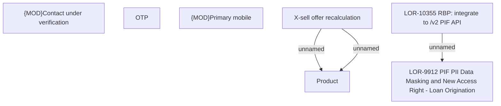

# LOR-10355 RBP: integrate to /v2 PIF API

- **Diagram Type**: Custom
- **Package**: HomerSelect/BSL/Requirements Model/In process/LOR/LOR-9912 PIF PII Data Masking & New Access Right - Loan Origination/LOR-10355 RBP: integrate to /v2 PIF API
- **Diagram ID**: 159134
- **Elements**: 12
- **Connectors**: 3

