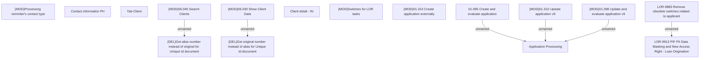

# LOR-9883 Remove obsolete switches related to applicant

```mermaid
graph TD
    MOD_Processing_remmiter_s_contact_type["{MOD}Processing remmiter's contact type"]
    Contact_information_PH["Contact information PH"]
    Tab_Client["Tab-Client"]
    MOD_06_040_Search_Clients["{MOD}06.040 Search Clients"]
    MOD_06_030_Show_Client_Data["{MOD}06.030 Show Client Data"]
    Client_detail_IN["Client detail - IN"]
    DEL_Get_original_number_instead_of_alias_for_Unique_Id_docum["{DEL}Get original number instead of alias for Unique Id document"]
    DEL_Get_alias_number_instead_of_original_for_Unique_Id_docum["{DEL}Get alias number instead of original for Unique Id document"]
    MOD_Switches_for_LOR_tasks["{MOD}Switches for LOR tasks"]
    Application_Processing["Application Processing"]
    MOD_01_314_Create_application_externally["{MOD}01.314 Create application externally"]
    MOD_01_310_Update_application_v9["{MOD}01.310 Update application v9"]
    n_01_095_Create_and_evaluate_application["01.095 Create and evaluate application"]
    MOD_01_098_Update_and_evaluate_application_v9["{MOD}01.098 Update and evaluate application v9"]
    LOR_9883_Remove_obsolete_switches_related_to_applicant["LOR-9883 Remove obsolete switches related to applicant"]
    LOR_9912_PIF_PII_Data_Masking_New_Access_Right_Loan_Originat["LOR-9912 PIF PII Data Masking and New Access Right - Loan Origination"]
    LOR_9883_Remove_obsolete_switches_related_to_applicant -->|unnamed| LOR_9912_PIF_PII_Data_Masking_New_Access_Right_Loan_Originat
    MOD_06_040_Search_Clients -->|unnamed| DEL_Get_alias_number_instead_of_original_for_Unique_Id_docum
    MOD_06_030_Show_Client_Data -->|unnamed| DEL_Get_original_number_instead_of_alias_for_Unique_Id_docum
    n_01_095_Create_and_evaluate_application -->|unnamed| Application_Processing
    MOD_01_310_Update_application_v9 -->|unnamed| Application_Processing
    MOD_01_098_Update_and_evaluate_application_v9 -->|unnamed| Application_Processing
```
