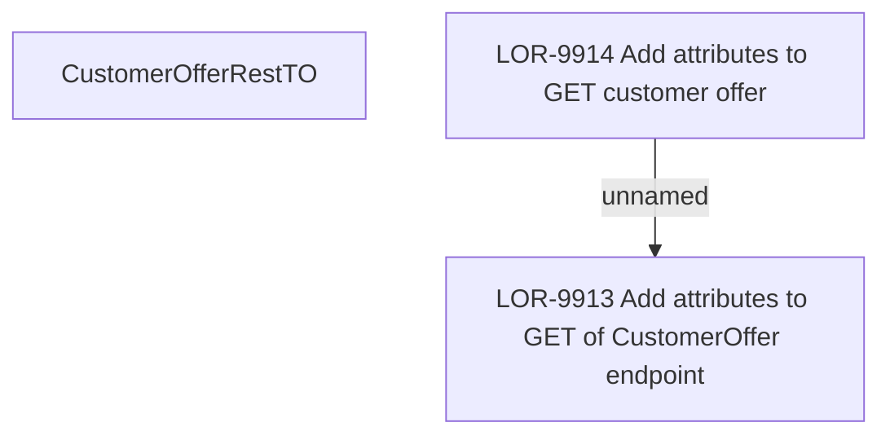

# LOR-9913 Add attributes to GET of CustomerOffer endpoint

- **Diagram Type**: Custom
- **Package**: HomerSelect/BSL/Requirements Model/In process/LOR/LOR-9913 Add attributes to GET of CustomerOffer endpoint
- **Diagram ID**: 155402
- **Elements**: 3
- **Connectors**: 1

