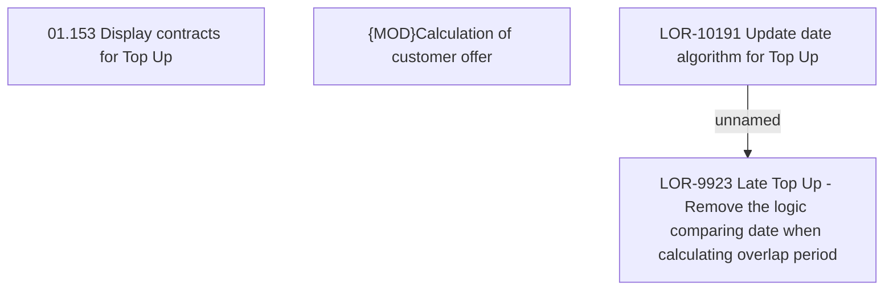

# LOR-9923 Late Top Up - Remove the logic comparing date when calculating overlap period

- **Diagram Type**: Custom
- **Package**: HomerSelect/BSL/Requirements Model/In process/LOR/LOR-9923 Late Top Up - Remove the logic comparing date when calculating overlap period
- **Diagram ID**: 157505
- **Elements**: 4
- **Connectors**: 1

