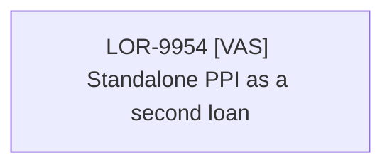

# LOR-9954 [VAS] Standalone PPI as a second loan

- **Diagram Type**: Custom
- **Package**: HomerSelect/BSL/Requirements Model/In process/LOR/LOR-9954 [VAS] Standalone PPI as a second loan
- **Diagram ID**: 156631
- **Elements**: 1
- **Connectors**: 0

