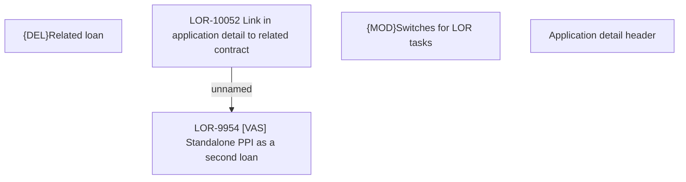

# LOR-10052 Link in application detail to related contract

```mermaid
graph TD
    DEL_Related_loan["{DEL}Related loan"]
    LOR_10052_Link_in_application_detail_to_related_contract["LOR-10052 Link in application detail to related contract"]
    MOD_Switches_for_LOR_tasks["{MOD}Switches for LOR tasks"]
    Application_detail_header["Application detail header"]
    LOR_9954_VAS_Standalone_PPI_as_a_second_loan["LOR-9954 [VAS] Standalone PPI as a second loan"]
    LOR_10052_Link_in_application_detail_to_related_contract -->|unnamed| LOR_9954_VAS_Standalone_PPI_as_a_second_loan
```
