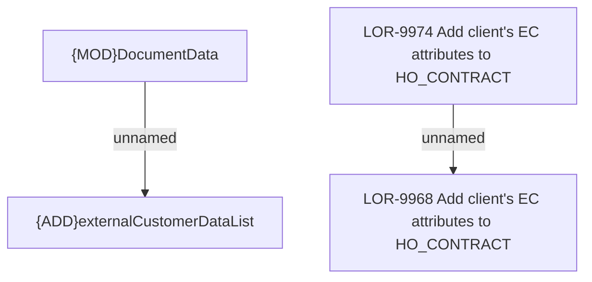

# LOR-9974 Add client's EC attributes to HO_CONTRACT

- **Diagram Type**: Custom
- **Package**: HomerSelect/BSL/Requirements Model/In process/LOR/LOR-9968 Add client's EC attributes to HO_CONTRACT/LOR-9974 Add client's EC attributes to HO_CONTRACT
- **Diagram ID**: 155963
- **Elements**: 4
- **Connectors**: 2

