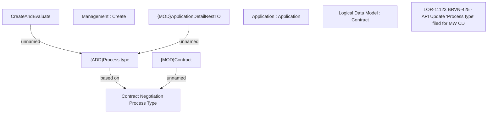

# LOR-11123 BRVN-425 - API Update "Process type" filed for MW CD

- **Diagram Type**: Custom
- **Package**: HomerSelect/BSL/Requirements Model/In process/LOR/VN/LOR-11123 BRVN-425 - API Update "Process type" filed for MW CD
- **Diagram ID**: 163896
- **Elements**: 9
- **Connectors**: 4

