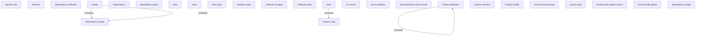

# CBL-15550 Bulk update of products

```mermaid
graph TD
    Dependency_assign["Dependency assign"]
    Variants_Set["Variants-Set"]
    Remove["Remove"]
    Dependency_attributes["Dependency attributes"]
    Assign["Assign"]
    Dependency["Dependency"]
    dependency_panel["dependency panel"]
    el_1867604["Note"]
    el_1867607["Note"]
    New_value["New value"]
    Attribute_name["Attribute name"]
    Attribute_changes["Attribute changes"]
    Attribute_panel["Attribute panel"]
    Product_attributes["Product attributes"]
    Product_attributes["Product attributes"]
    UI_Control["UI Control"]
    list_of_attributes["list of attributes"]
    Bulk_operation_search_result["Bulk operation search result"]
    el_1867612["Note"]
    Inactive_versions["Inactive versions"]
    Product_profile["Product profile"]
    Initial_transacton_type["Initial transacton type"]
    product_type["product type"]
    Product_code["Product code"]
    UI_Control["UI Control"]
    Product_bulk_update_search["Product bulk update search"]
    Product_bulk_update["Product bulk update"]
    dependency_assign["dependency assign"]
    el_1867612 -->|unnamed| Product_code
    Product_attributes -->|unnamed| Product_attributes
    Assign -->|unnamed| Dependency_assign
    Assign -->|unnamed| Dependency_assign
```
