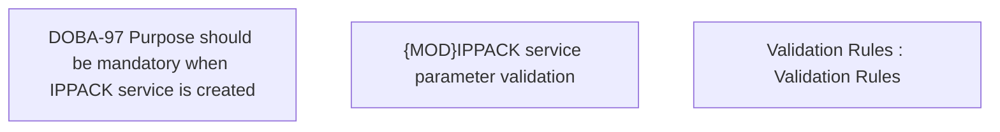

# DOBA-97

- **Diagram Type**: Custom
- **Package**: HomerSelect/BSL/Requirements Model/In process/PCG/HoselNG / FLIP/DOBA-97
- **Diagram ID**: 161640
- **Elements**: 3
- **Connectors**: 0

```mermaid
graph TD
    DOBA_97_Purpose_should_be_mandatory_when_IPPACK_service_is_c["DOBA-97 Purpose should be mandatory when IPPACK service is created"]
    MOD_IPPACK_service_parameter_validation["{MOD}IPPACK service parameter validation"]
    Validation_Rules_Validation_Rules["Validation Rules : Validation Rules"]
```
