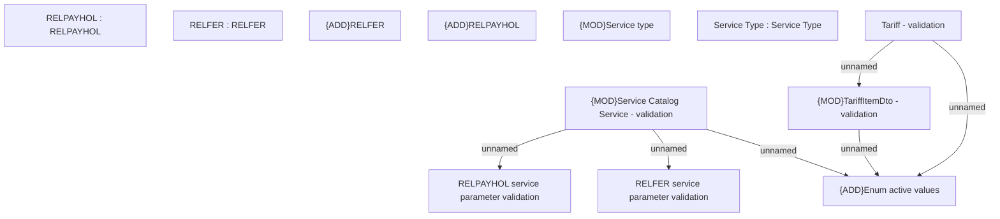

# BREIT-62 – AM/AP/PCG Product configuration for Flip

```mermaid
graph TD
    RELPAYHOL_service_parameter_validation["RELPAYHOL service parameter validation"]
    RELFER_service_parameter_validation["RELFER service parameter validation"]
    MOD_Service_Catalog_Service_validation["{MOD}Service Catalog Service - validation"]
    RELPAYHOL_RELPAYHOL["RELPAYHOL : RELPAYHOL"]
    RELFER_RELFER["RELFER : RELFER"]
    ADD_RELFER["{ADD}RELFER"]
    ADD_RELPAYHOL["{ADD}RELPAYHOL"]
    MOD_Service_type["{MOD}Service type"]
    Service_Type_Service_Type["Service Type : Service Type"]
    ADD_Enum_active_values["{ADD}Enum active values"]
    MOD_TariffItemDto_validation["{MOD}TariffItemDto - validation"]
    Tariff_validation["Tariff - validation"]
    MOD_Service_Catalog_Service_validation -->|unnamed| RELPAYHOL_service_parameter_validation
    MOD_Service_Catalog_Service_validation -->|unnamed| RELFER_service_parameter_validation
    MOD_Service_Catalog_Service_validation -->|unnamed| ADD_Enum_active_values
    Tariff_validation -->|unnamed| MOD_TariffItemDto_validation
    MOD_TariffItemDto_validation -->|unnamed| ADD_Enum_active_values
    Tariff_validation -->|unnamed| ADD_Enum_active_values
```
