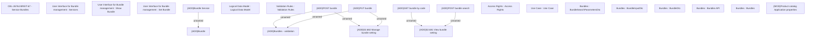

# PCG-4918 CBL-26764 BREIT-67 - Service Bundles

```mermaid
graph TD
    CBL_26764_BREIT_67_Service_Bundles["CBL-26764 BREIT-67 - Service Bundles"]
    User_Interface_for_Bundle_management_Services["User Interface for Bundle management : Services"]
    User_Interface_for_Bundle_management_Show_Bundle["User Interface for Bundle management : Show Bundle"]
    User_Interface_for_Bundle_management_Set_Bundle["User Interface for Bundle management : Set Bundle"]
    ADD_Bundle_Service["{ADD}Bundle Service"]
    ADD_Bundle["{ADD}Bundle"]
    Logical_Data_Model_Logical_Data_Model["Logical Data Model : Logical Data Model"]
    ADD_Bundles_validation["{ADD}Bundles - validation"]
    Validation_Rules_Validation_Rules["Validation Rules : Validation Rules"]
    ADD_PUT_bundle["{ADD}PUT bundle"]
    ADD_POST_bundle_search["{ADD}POST bundle search"]
    ADD_POST_bundle["{ADD}POST bundle"]
    ADD_GET_bundle_by_code["{ADD}GET bundle by code"]
    Access_Rights_Access_Rights["Access Rights : Access Rights"]
    Use_Case_Use_Case["Use Case : Use Case"]
    ADD_02_682_Manage_bundle_setting["{ADD}02.682 Manage bundle setting"]
    ADD_02_681_View_bundle_setting["{ADD}02.681 View bundle setting"]
    Bundles_BundleSearchParametersDto["Bundles : BundleSearchParametersDto"]
    Bundles_BundleInputDto["Bundles : BundleInputDto"]
    Bundles_BundleDto["Bundles : BundleDto"]
    Bundles_Bundles_API["Bundles : Bundles API"]
    Bundles_Bundles["Bundles : Bundles"]
    MOD_Product_catalog_Application_properties["{MOD}Product catalog Application properties"]
    ADD_Bundle_Service -->|unnamed| ADD_Bundle
    ADD_POST_bundle -->|unnamed| ADD_Bundles_validation
    ADD_PUT_bundle -->|unnamed| ADD_Bundles_validation
    ADD_POST_bundle -->|unnamed| ADD_02_682_Manage_bundle_setting
    ADD_PUT_bundle -->|unnamed| ADD_02_682_Manage_bundle_setting
    ADD_GET_bundle_by_code -->|unnamed| ADD_02_681_View_bundle_setting
    ADD_POST_bundle_search -->|unnamed| ADD_02_681_View_bundle_setting
```
