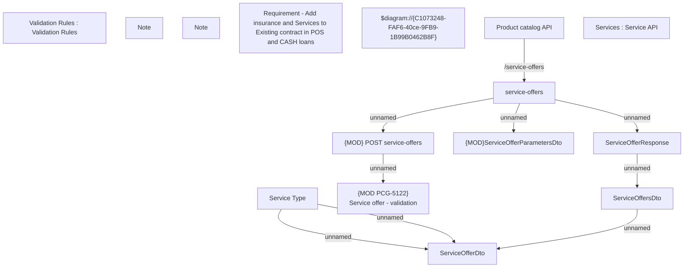

# PCG-5122 - Add Insurances and Services to Existing Contract in POS Loan and Cash Loan

- **Diagram Type**: Custom
- **Package**: HomerSelect/BSL/Requirements Model/In process/PCG/ID/PCG-5122 - Add Insurances and Services to Existing Contract in POS Loan and Cash Loan
- **Diagram ID**: 161520
- **Elements**: 15
- **Connectors**: 9

