# PCG-5652 BRID-1756 - Additional Value in CustomerOffer REST API Responses

- **Diagram Type**: Custom
- **Package**: HomerSelect/BSL/Requirements Model/In process/PCG/ID/PCG-5652 BRID-1756 - Additional Value in CustomerOffer REST API Responses
- **Diagram ID**: 164633
- **Elements**: 15
- **Connectors**: 6

```mermaid
graph TD
    ADD_Insurance_service_fees["{ADD}Insurance service fees"]
    ADD_Provided_Credit_Amount_Without_Insurance["{ADD}Provided Credit Amount Without Insurance"]
    ADD_Annuity_without_Insurance_calculation["{ADD}Annuity without Insurance calculation"]
    ADD_Annuity_base_without_Insurance["{ADD}Annuity base without Insurance"]
    Annuity_and_Interest_Calculation_Annuity_calculations["Annuity and Interest Calculation : Annuity calculations"]
    Financial_calculations_Financial_calculations["Financial calculations : Financial calculations"]
    ADD_Monthly_Payment_Without_Insurance["{ADD}Monthly Payment Without Insurance"]
    MOD_OfferDto["{MOD}OfferDto"]
    Product_Calculator_OfferDto["Product Calculator : OfferDto"]
    Traditional_Product_without_Financing_Scheme_Calculation_of_["Traditional Product without Financing Scheme : Calculation of financial parameters of offer"]
    el_1881118["Note"]
    MOD_Standard_STND["{MOD}Standard (STND)"]
    Calculation_type_algorithms_Offer_Calculation_algorithm_STAN["Calculation type algorithms : Offer Calculation algorithm - STANDARD"]
    Business_Rules_Calculate_product_offer["Business Rules : Calculate product offer"]
    PCG_5652_BRID_1756_Additional_Value_in_CustomerOffer_REST_AP["PCG-5652 BRID-1756 - Additional Value in CustomerOffer REST API Responses"]
    ADD_Provided_Credit_Amount_Without_Insurance -->|unnamed| ADD_Insurance_service_fees
    ADD_Monthly_Payment_Without_Insurance -->|unnamed| ADD_Insurance_service_fees
    MOD_Standard_STND -->|unnamed| ADD_Provided_Credit_Amount_Without_Insurance
    MOD_Standard_STND -->|unnamed| ADD_Annuity_without_Insurance_calculation
    MOD_Standard_STND -->|unnamed| ADD_Annuity_base_without_Insurance
    MOD_Standard_STND -->|unnamed| ADD_Monthly_Payment_Without_Insurance
```

