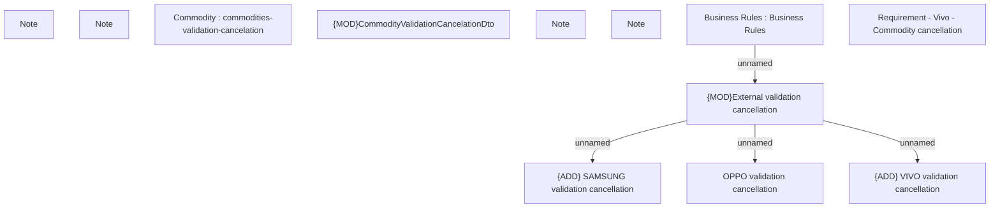

# PCG-5308 - Vivo - IMEI unblocking API (CBL-28657)

```mermaid
graph TD
    ADD_VIVO_validation_cancellation["{ADD} VIVO validation cancellation"]
    el_1859257["Note"]
    el_1859255["Note"]
    Commodity_commodities_validation_cancelation["Commodity : commodities-validation-cancelation"]
    MOD_CommodityValidationCancelationDto["{MOD}CommodityValidationCancelationDto"]
    el_1859254["Note"]
    el_1859258["Note"]
    OPPO_validation_cancellation["OPPO validation cancellation"]
    ADD_SAMSUNG_validation_cancellation["{ADD} SAMSUNG validation cancellation"]
    MOD_External_validation_cancellation["{MOD}External validation cancellation"]
    Business_Rules_Business_Rules["Business Rules : Business Rules"]
    Requirement_Vivo_Commodity_cancellation["Requirement - Vivo - Commodity cancellation"]
    Business_Rules_Business_Rules -->|unnamed| MOD_External_validation_cancellation
    MOD_External_validation_cancellation -->|unnamed| ADD_SAMSUNG_validation_cancellation
    MOD_External_validation_cancellation -->|unnamed| OPPO_validation_cancellation
    MOD_External_validation_cancellation -->|unnamed| ADD_VIVO_validation_cancellation
```
