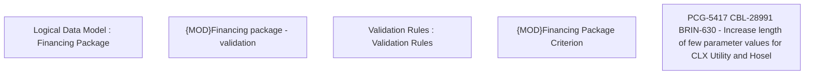

# PCG-5417 CBL-28991 BRIN-630 - Increase length of few parameter values for CLX Utility and Hosel

- **Diagram Type**: Custom
- **Package**: HomerSelect/BSL/Requirements Model/In process/PCG/IN/PCG-5417 CBL-28991 BRIN-630 - Increase length of few parameter values for CLX Utility and Hosel
- **Diagram ID**: 162856
- **Elements**: 5
- **Connectors**: 0

