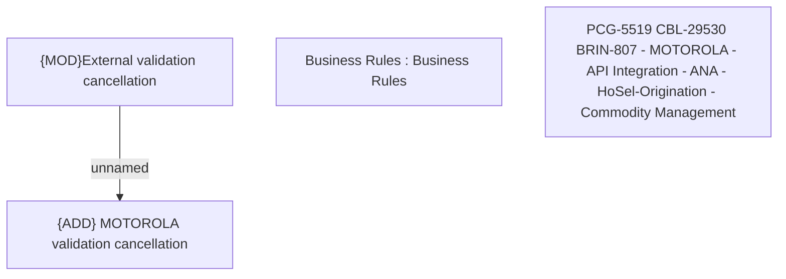

# PCG-5519 CBL-29530 BRIN-807 - MOTOROLA - API Integration - ANA - HoSel-Origination - Commodity Management

- **Diagram Type**: Custom
- **Package**: HomerSelect/BSL/Requirements Model/In process/PCG/IN/PCG-5519 CBL-29530 BRIN-807 - MOTOROLA - API Integration - ANA - HoSel-Origination - Commodity Management
- **Diagram ID**: 163042
- **Elements**: 4
- **Connectors**: 1

