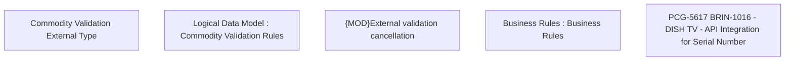

# PCG-5617 BRIN-1016 - DISH TV - API Integration for Serial Number

- **Diagram Type**: Custom
- **Package**: HomerSelect/BSL/Requirements Model/In process/PCG/IN/PCG-5617 BRIN-1016 - DISH TV - API Integration for Serial Number
- **Diagram ID**: 163995
- **Elements**: 5
- **Connectors**: 0

