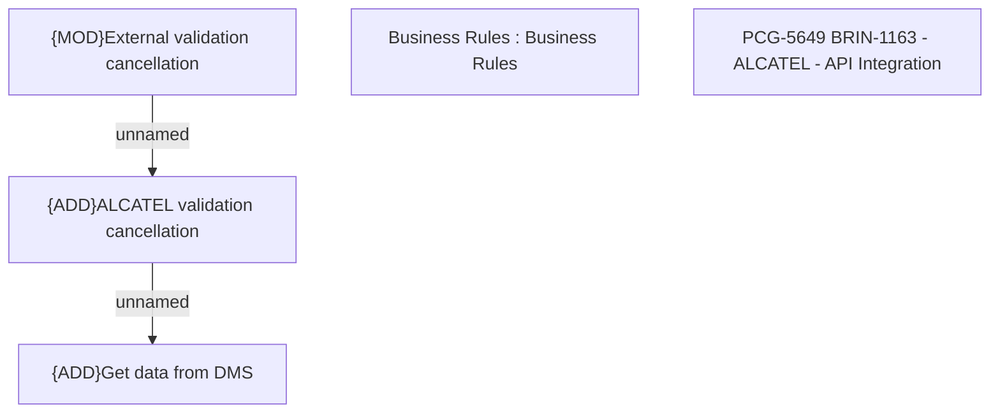

# PCG-5649 BRIN-1163 - ALCATEL - API Integration

```mermaid
graph TD
    ADD_Get_data_from_DMS["{ADD}Get data from DMS"]
    ADD_ALCATEL_validation_cancellation["{ADD}ALCATEL validation cancellation"]
    MOD_External_validation_cancellation["{MOD}External validation cancellation"]
    Business_Rules_Business_Rules["Business Rules : Business Rules"]
    PCG_5649_BRIN_1163_ALCATEL_API_Integration["PCG-5649 BRIN-1163 - ALCATEL - API Integration"]
    ADD_ALCATEL_validation_cancellation -->|unnamed| ADD_Get_data_from_DMS
    MOD_External_validation_cancellation -->|unnamed| ADD_ALCATEL_validation_cancellation
```
