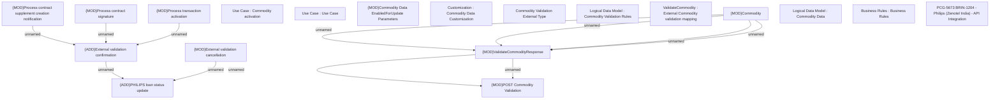

# PCG-5673 BRIN-1204 - Philips (Zenotel India) - API Integration

```mermaid
graph TD
    ADD_External_validation_confirmation["{ADD}External validation confirmation"]
    MOD_Process_contract_supplement_creation_notification["{MOD}Process contract supplement creation notification"]
    MOD_Process_contract_signature["{MOD}Process contract signature"]
    MOD_Process_transaction_activation["{MOD}Process transaction activation"]
    Use_Case_Commodity_activation["Use Case : Commodity activation"]
    MOD_POST_Commodity_Validation["{MOD}POST Commodity Validation"]
    Use_Case_Use_Case["Use Case : Use Case"]
    MOD_Commodity_Data_EnabledForUpdate_Parameters["{MOD}Commodity Data EnabledForUpdate Parameters"]
    Customization_Commodity_Data_Customization["Customization : Commodity Data Customization"]
    Commodity_Validation_External_Type["Commodity Validation External Type"]
    Logical_Data_Model_Commodity_Validation_Rules["Logical Data Model : Commodity Validation Rules"]
    MOD_ValidateCommodityResponse["{MOD}ValidateCommodityResponse"]
    ValidateCommodity_External_Commodity_validation_mapping["ValidateCommodity : External Commodity validation mapping"]
    MOD_Commodity["{MOD}Commodity"]
    Logical_Data_Model_Commodity_Data["Logical Data Model : Commodity Data"]
    ADD_PHILIPS_loan_status_update["{ADD}PHILIPS loan status update"]
    MOD_External_validation_cancellation["{MOD}External validation cancellation"]
    Business_Rules_Business_Rules["Business Rules : Business Rules"]
    PCG_5673_BRIN_1204_Philips_Zenotel_India_API_Integration["PCG-5673 BRIN-1204 - Philips (Zenotel India) - API Integration"]
    MOD_Process_contract_supplement_creation_notification -->|unnamed| ADD_External_validation_confirmation
    MOD_Process_contract_signature -->|unnamed| ADD_External_validation_confirmation
    MOD_Process_transaction_activation -->|unnamed| ADD_External_validation_confirmation
    MOD_ValidateCommodityResponse -->|unnamed| MOD_POST_Commodity_Validation
    MOD_ValidateCommodityResponse -->|unnamed| MOD_POST_Commodity_Validation
    MOD_Commodity -->|unnamed| MOD_ValidateCommodityResponse
    MOD_Commodity -->|unnamed| MOD_ValidateCommodityResponse
    MOD_Commodity -->|unnamed| MOD_ValidateCommodityResponse
    MOD_Commodity -->|unnamed| MOD_ValidateCommodityResponse
    ADD_External_validation_confirmation -->|unnamed| ADD_PHILIPS_loan_status_update
    MOD_External_validation_cancellation -->|unnamed| ADD_PHILIPS_loan_status_update
```
