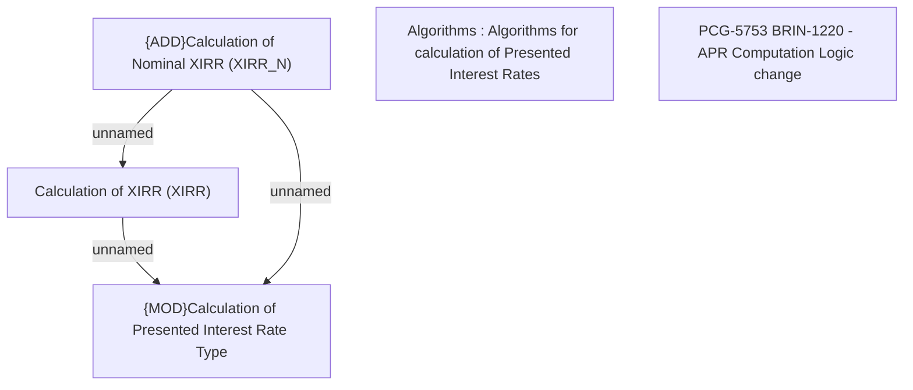

# PCG-5753 BRIN-1220 - APR Computation Logic change

- **Diagram Type**: Custom
- **Package**: HomerSelect/BSL/Requirements Model/In process/PCG/IN/PCG-5753 BRIN-1220 - APR Computation Logic change
- **Diagram ID**: 164637
- **Elements**: 5
- **Connectors**: 3

