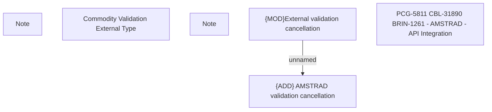

# PCG-5811 CBL-31890 BRIN-1261 - AMSTRAD - API Integration

```mermaid
graph TD
    ADD_AMSTRAD_validation_cancellation["{ADD} AMSTRAD validation cancellation"]
    el_1881681["Note"]
    Commodity_Validation_External_Type["Commodity Validation External Type"]
    el_1881682["Note"]
    MOD_External_validation_cancellation["{MOD}External validation cancellation"]
    PCG_5811_CBL_31890_BRIN_1261_AMSTRAD_API_Integration["PCG-5811 CBL-31890 BRIN-1261 - AMSTRAD - API Integration"]
    MOD_External_validation_cancellation -->|unnamed| ADD_AMSTRAD_validation_cancellation
```
