# PCG-5611 BRPH-2423 - Debt Purchase Support in HOSEL - PRC

- **Diagram Type**: Custom
- **Package**: HomerSelect/BSL/Requirements Model/In process/PCG/PH/BRPH-2423 - Debt Purchase Support in HOSEL
- **Diagram ID**: 164634
- **Elements**: 8
- **Connectors**: 0

```mermaid
graph TD
    Validation_Rules_Validation_Rules["Validation Rules : Validation Rules"]
    MOD_Product_activation_validation_rules["{MOD}Product activation validation rules"]
    Validation_Rules_Validation_Rules["Validation Rules : Validation Rules"]
    Accounting_Method["Accounting Method"]
    Logical_Data_Model_Product_Profile["Logical Data Model : Product Profile"]
    MOD_Product_Flag_Type_Definition["{MOD}Product Flag Type Definition"]
    Logical_Data_Model_Product_Flags["Logical Data Model : Product - Flags"]
    PCG_5611_BRPH_2423_Debt_Purchase_Support_in_HOSEL["PCG-5611 BRPH-2423 - Debt Purchase Support in HOSEL"]
```

