# PCG-5620 BRPH-2423 - Debt Purchase Support in HOSEL - POC

- **Diagram Type**: Custom
- **Package**: HomerSelect/BSL/Requirements Model/In process/PCG/PH/BRPH-2423 - Debt Purchase Support in HOSEL
- **Diagram ID**: 164635
- **Elements**: 14
- **Connectors**: 4

```mermaid
graph TD
    Product_Calculator_OfferRecalculationRequest["Product Calculator : OfferRecalculationRequest"]
    Product_Calculator_OfferCalculationRequest["Product Calculator : OfferCalculationRequest"]
    MOD_Structured_Parameter_Types["{MOD}Structured Parameter Types"]
    Business_Rules_Offer_recalculation["Business Rules : Offer recalculation"]
    MOD_Generation_of_Preliminary_Installment_Schedule["{MOD}Generation of Preliminary Installment Schedule"]
    Business_Rules_Business_Rules["Business Rules : Business Rules"]
    MOD_Algorithm_Calculate_tariff_item_amount["{MOD}Algorithm: Calculate tariff item amount"]
    MOD_Fees_determination["{MOD}Fees determination"]
    Auxiliary_evaluations_Calculate_Product_Offer_Auxiliary_eval["Auxiliary evaluations : Calculate Product Offer - Auxiliary evaluations"]
    MOD_Evaluate_First_Installment_Due_Date["{MOD}Evaluate First Installment Due Date"]
    MOD_Offer_recalculation["{MOD}Offer recalculation"]
    MOD_Calculate_product_offer["{MOD}Calculate product offer"]
    Business_Rules_Calculate_product_offer["Business Rules : Calculate product offer"]
    PCG_5620_BRPH_2423_Debt_Purchase_Support_in_HOSEL["PCG-5620 BRPH-2423 - Debt Purchase Support in HOSEL"]
    MOD_Calculate_product_offer -->|unnamed| MOD_Fees_determination
    MOD_Offer_recalculation -->|unnamed| MOD_Fees_determination
    MOD_Calculate_product_offer -->|unnamed| MOD_Evaluate_First_Installment_Due_Date
    MOD_Offer_recalculation -->|unnamed| MOD_Evaluate_First_Installment_Due_Date
```

