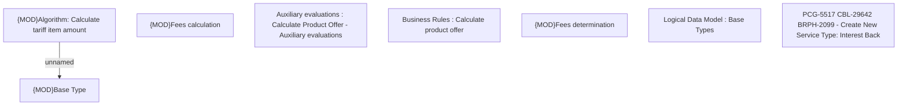

# PCG-5517 CBL-29642 BRPH-2099 - Create New Service Type: Interest Back

```mermaid
graph TD
    MOD_Algorithm_Calculate_tariff_item_amount["{MOD}Algorithm: Calculate tariff item amount"]
    MOD_Fees_calculation["{MOD}Fees calculation"]
    Auxiliary_evaluations_Calculate_Product_Offer_Auxiliary_eval["Auxiliary evaluations : Calculate Product Offer - Auxiliary evaluations"]
    Business_Rules_Calculate_product_offer["Business Rules : Calculate product offer"]
    MOD_Fees_determination["{MOD}Fees determination"]
    MOD_Base_Type["{MOD}Base Type"]
    Logical_Data_Model_Base_Types["Logical Data Model : Base Types"]
    PCG_5517_CBL_29642_BRPH_2099_Create_New_Service_Type_Interes["PCG-5517 CBL-29642 BRPH-2099 - Create New Service Type: Interest Back"]
    MOD_Algorithm_Calculate_tariff_item_amount -->|unnamed| MOD_Base_Type
```
