# PCG-5594 CBL-30020 BRPH-2306 - Product Assignment Governance - PH - ANA - HoSel - Product Catalog

- **Diagram Type**: Custom
- **Package**: HomerSelect/BSL/Requirements Model/In process/PCG/PH/PCG-5594 CBL-30020 BRPH-2306 - Product Assignment Governance - PH - ANA - HoSel - Product Catalog
- **Diagram ID**: 163895
- **Elements**: 8
- **Connectors**: 0

```mermaid
graph TD
    ADD_Search_salesroom_in_HomeSIS["{ADD}Search salesroom in HomeSIS"]
    ADD_Search_partner_detail_in_HomeSIS["{ADD}Search partner detail in HomeSIS"]
    Business_Rules_Business_Rules["Business Rules : Business Rules"]
    ADD_GET_product_assignments["{ADD}GET product-assignments"]
    Use_Case_Use_Case["Use Case : Use Case"]
    Products_Assignment_Governance["Products Assignment Governance"]
    Salesroom_assignment_Salesroom_assignment_API["Salesroom assignment : Salesroom assignment API"]
    Salesroom_assignment_Salesroom_assignment["Salesroom assignment : Salesroom assignment"]
```

