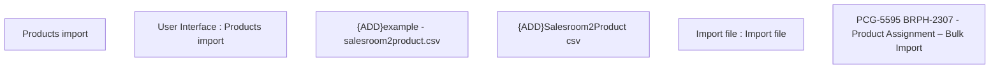

# PCG-5595 BRPH-2307 - Product Assignment – Bulk Import

- **Diagram Type**: Custom
- **Package**: HomerSelect/BSL/Requirements Model/In process/PCG/PH/PCG-5595 BRPH-2307 - Product Assignment – Bulk Import
- **Diagram ID**: 163463
- **Elements**: 6
- **Connectors**: 0

