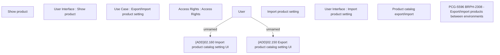

# PCG-5596 BRPH-2308 - Export/import products between environments

```mermaid
graph TD
    Show_product["Show product"]
    User_Interface_Show_product["User Interface : Show product"]
    Use_Case_Export_Import_product_setting["Use Case : Export/Import product setting"]
    Access_Rights_Access_Rights["Access Rights : Access Rights"]
    User["User"]
    Import_product_setting["Import product setting"]
    User_Interface_Import_product_setting["User Interface : Import product setting"]
    ADD_02_150_Export_product_catalog_setting_UI["{ADD}02.150 Export product catalog setting UI"]
    ADD_02_160_Import_product_catalog_setting_UI["{ADD}02.160 Import product catalog setting UI"]
    Product_catalog_export_import["Product catalog export/import"]
    PCG_5596_BRPH_2308_Export_import_products_between_environmen["PCG-5596 BRPH-2308 - Export/import products between environments"]
    User -->|unnamed| ADD_02_160_Import_product_catalog_setting_UI
    User -->|unnamed| ADD_02_150_Export_product_catalog_setting_UI
```
