# PCG-5653 CBL-31043 BRPH-2754 - Short term product versions (promo version)

- **Diagram Type**: Custom
- **Package**: HomerSelect/BSL/Requirements Model/In process/PCG/PH/PCG-5653 CBL-31043 BRPH-2754 - Short term product versions (promo version)
- **Diagram ID**: 164680
- **Elements**: 23
- **Connectors**: 3

```mermaid
graph TD
    Database["Database"]
    Product_Product["Product : Product"]
    el_1881483["Note"]
    Product_ProductDto["Product : ProductDto"]
    el_1881486["Note"]
    Product_validation["Product - validation"]
    Use_Case_Use_Case["Use Case : Use Case"]
    el_1881485["Note"]
    Planned_version_activation_date["Planned version activation date"]
    el_1881478["Note"]
    el_1881480["Note"]
    MOD_Product["{MOD}Product"]
    User_Interface_Activation_date["User Interface : Activation date"]
    Automatic_Version_activation_processing["Automatic Version activation processing"]
    Business_rules["Business rules"]
    Activation_Deactivation_job["Activation + Deactivation job"]
    Update_API["Update API"]
    MOD_PUT_product_activations["{MOD}PUT product activations"]
    MOD_PUT_products["{MOD}PUT products"]
    MOD_POST_products["{MOD}POST products"]
    GET_products["GET products"]
    PCG_5653_CBL_31043_BRPH_2754_Short_term_product_versions_pro["PCG-5653 CBL-31043 BRPH-2754 Short term product versions (promo version)"]
    Product_Product_API["Product : Product API"]
    MOD_PUT_product_activations -->|unnamed| Product_validation
    MOD_PUT_products -->|unnamed| Product_validation
    MOD_POST_products -->|unnamed| Product_validation
```

