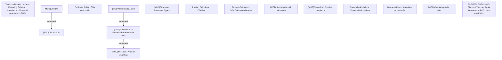

# PCG-5669 BRPH-2800 - Discount Voucher: Apply Discounts in POS Loan Application

```mermaid
graph TD
    ADD_DiscountDto["{ADD}DiscountDto"]
    Traditional_Product_without_Financing_Scheme_Calculation_of_["Traditional Product without Financing Scheme : Calculation of financial parameters of offer"]
    MOD_Offer_recalculation["{MOD}Offer recalculation"]
    Business_Rules_Offer_recalculation["Business Rules : Offer recalculation"]
    MOD_OfferDto["{MOD}OfferDto"]
    MOD_Structured_Parameter_Types["{MOD}Structured Parameter Types"]
    Product_Calculator_OfferDto["Product Calculator : OfferDto"]
    Product_Calculator_OfferCalculationRequest["Product Calculator : OfferCalculationRequest"]
    MOD_Simple_principal_calculation["{MOD}Simple principal calculation"]
    MOD_Subsidized_Principal_calculation["{MOD}Subsidized Principal calculation"]
    MOD_Calculation_of_Financial_Parameters_of_offer["{MOD}Calculation of Financial Parameters of offer"]
    Financial_calculations_Financial_calculations["Financial calculations : Financial calculations"]
    MOD_Net_Credit_Amount_definition["{MOD}Net Credit Amount definition"]
    Business_Rules_Calculate_product_offer["Business Rules : Calculate product offer"]
    MOD_Calculate_product_offer["{MOD}Calculate product offer"]
    PCG_5669_BRPH_2800_Discount_Voucher_Apply_Discounts_in_POS_L["PCG-5669 BRPH-2800 - Discount Voucher: Apply Discounts in POS Loan Application"]
    MOD_Calculation_of_Financial_Parameters_of_offer -->|unnamed| MOD_Net_Credit_Amount_definition
    MOD_OfferDto -->|unnamed| ADD_DiscountDto
    MOD_Offer_recalculation -->|unnamed| MOD_Calculation_of_Financial_Parameters_of_offer
```
