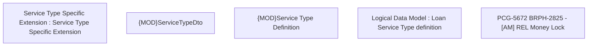

# PCG-5672 BRPH-2825 - [AM] REL Money Lock

- **Diagram Type**: Custom
- **Package**: HomerSelect/BSL/Requirements Model/In process/PCG/PH/PCG-5672 BRPH-2825 - [AM] REL Money Lock
- **Diagram ID**: 164636
- **Elements**: 5
- **Connectors**: 0

