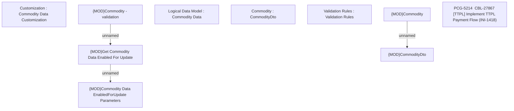

# CBL-27867 [TTPL] Implement TTPL Payment Flow (INI-1418)

- **Diagram Type**: Custom
- **Package**: HomerSelect/BSL/Requirements Model/In process/PCG/VN/CBL-27867 [TTPL] Implement TTPL Payment Flow (INI-1418)
- **Diagram ID**: 161943
- **Elements**: 10
- **Connectors**: 3

