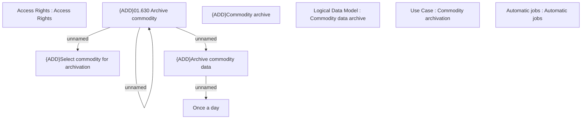

# Commodity archivation

```mermaid
graph TD
    Access_Rights_Access_Rights["Access Rights : Access Rights"]
    ADD_01_630_Archive_commodity["{ADD}01.630 Archive commodity"]
    ADD_Select_commodity_for_archivation["{ADD}Select commodity for archivation"]
    ADD_Commodity_archive["{ADD}Commodity archive"]
    Logical_Data_Model_Commodity_data_archive["Logical Data Model : Commodity data archive"]
    ADD_01_630_Archive_commodity["{ADD}01.630 Archive commodity"]
    Use_Case_Commodity_archivation["Use Case : Commodity archivation"]
    Once_a_day["Once a day"]
    ADD_Archive_commodity_data["{ADD}Archive commodity data"]
    Automatic_jobs_Automatic_jobs["Automatic jobs : Automatic jobs"]
    ADD_Archive_commodity_data -->|unnamed| Once_a_day
    ADD_01_630_Archive_commodity -->|unnamed| ADD_Select_commodity_for_archivation
    ADD_01_630_Archive_commodity -->|unnamed| ADD_01_630_Archive_commodity
    ADD_01_630_Archive_commodity -->|unnamed| ADD_Archive_commodity_data
```
