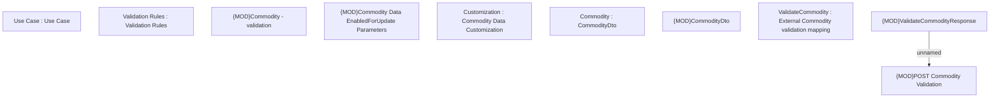

# PCG-4746 CBL-24598 [SUBVENTION] UPDATE OPPO IMEI VALIDATION INFORMATION

```mermaid
graph TD
    Use_Case_Use_Case["Use Case : Use Case"]
    MOD_POST_Commodity_Validation["{MOD}POST Commodity Validation"]
    Validation_Rules_Validation_Rules["Validation Rules : Validation Rules"]
    MOD_Commodity_validation["{MOD}Commodity - validation"]
    MOD_Commodity_Data_EnabledForUpdate_Parameters["{MOD}Commodity Data EnabledForUpdate Parameters"]
    Customization_Commodity_Data_Customization["Customization : Commodity Data Customization"]
    Commodity_CommodityDto["Commodity : CommodityDto"]
    MOD_CommodityDto["{MOD}CommodityDto"]
    ValidateCommodity_External_Commodity_validation_mapping["ValidateCommodity : External Commodity validation mapping"]
    MOD_ValidateCommodityResponse["{MOD}ValidateCommodityResponse"]
    MOD_ValidateCommodityResponse -->|unnamed| MOD_POST_Commodity_Validation
```
