# PCG-5124 CBL-28112

- **Diagram Type**: Custom
- **Package**: HomerSelect/BSL/Requirements Model/In process/PCG/VN/PCG-5124 CBL-28112 PER – Change the setup Minimal last installment amount and Disable PER service after the first successful execution
- **Diagram ID**: 163390
- **Elements**: 15
- **Connectors**: 4

```mermaid
graph TD
    Search_for_Allowed_Base_Types_by_Usage["Search for Allowed Base Types by Usage"]
    Business_Rules_Base_Types["Business Rules : Base Types"]
    Logical_Data_Model_Base_Types["Logical Data Model : Base Types"]
    MOD_Base_Type_Usage["{MOD}Base Type Usage"]
    Allowed_Base_Type_Usage["Allowed Base Type Usage"]
    MOD_Allowed_Base_Types_Usage_setting["{MOD}Allowed Base Types Usage - setting"]
    User_Interface_Model_Show_Partial_early_repayment_properties["User Interface Model : Show Partial early repayment properties"]
    User_Interface_Model_Set_Partial_early_repayment_properties["User Interface Model : Set Partial early repayment properties"]
    MOD_ServiceParametersDto_validation["{MOD}ServiceParametersDto - validation"]
    Validation_Rules_Validation_Rules["Validation Rules : Validation Rules"]
    MOD_ServiceParametersPER["{MOD}ServiceParametersPER"]
    PER_PER_Data["PER : PER Data"]
    MOD_Partial_Early_Repayment_Service["{MOD}Partial Early Repayment Service"]
    PER_Partial_early_repayment_setting["PER : Partial early repayment setting"]
    PCG_4124_CBL_28112_PER_Change_the_setup_Minimal_last_install["PCG-4124 CBL-28112 PER – Change the setup Minimal last installment amount and Disable PER service after the first successful execution"]
    MOD_ServiceParametersDto_validation -->|unnamed| Search_for_Allowed_Base_Types_by_Usage
    MOD_Partial_Early_Repayment_Service -->|unnamed| MOD_Base_Type_Usage
    Allowed_Base_Type_Usage -->|unnamed| MOD_Allowed_Base_Types_Usage_setting
    Allowed_Base_Type_Usage -->|unnamed| MOD_Base_Type_Usage
```

