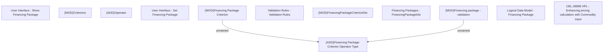

# PCG-5332 CBL-28998 HPL - Enhancing pricing calculation with Commodity input

```mermaid
graph TD
    User_Interface_Show_Financing_Package["User Interface : Show Financing Package"]
    MOD_Criterions["{MOD}Criterions"]
    ADD_Operator["{ADD}Operator"]
    User_Interface_Set_Financing_Package["User Interface : Set Financing Package"]
    MOD_Financing_package_validation["{MOD}Financing package - validation"]
    Validation_Rules_Validation_Rules["Validation Rules : Validation Rules"]
    MOD_FinancingPackageCriterionDto["{MOD}FinancingPackageCriterionDto"]
    Financing_Packages_FinancingPackageDto["Financing Packages : FinancingPackageDto"]
    ADD_Financing_Package_Criterion_Operator_Type["{ADD}Financing Package Criterion Operator Type"]
    MOD_Financing_Package_Criterion["{MOD}Financing Package Criterion"]
    Logical_Data_Model_Financing_Package["Logical Data Model : Financing Package"]
    CBL_28998_HPL_Enhancing_pricing_calculation_with_Commodity_i["CBL-28998 HPL - Enhancing pricing calculation with Commodity input"]
    MOD_Financing_Package_Criterion -->|unnamed| ADD_Financing_Package_Criterion_Operator_Type
    MOD_Financing_package_validation -->|unnamed| ADD_Financing_Package_Criterion_Operator_Type
```
