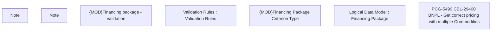

# PCG-5499 CBL-29460 BNPL - Get correct pricing with multiple Commodities

- **Diagram Type**: Custom
- **Package**: HomerSelect/BSL/Requirements Model/In process/PCG/VN/PCG-5499 CBL-29460 BNPL - Get correct pricing with multiple Commodities
- **Diagram ID**: 163007
- **Elements**: 7
- **Connectors**: 0

