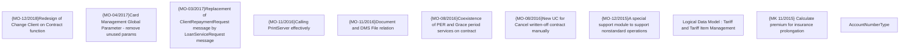

# Contract Management

```mermaid
graph TD
    MO_12_2018_Redesign_of_Change_Client_on_Contract_function["{MO-12/2018}Redesign of Change Client on Contract function"]
    MO_04_2017_Card_Management_Global_Parameter_remove_unused_pa["{MO-04/2017}Card Management Global Parameter - remove unused params"]
    MO_03_2017_Replacement_of_ClientRepaymentRequest_message_by_["{MO-03/2017}Replacement of ClientRepaymentRequest message by LoanServiceRequest message"]
    MO_11_2016_Calling_PrintServer_effectively["{MO-11/2016}Calling PrintServer effectively"]
    MO_11_2016_Document_and_DMS_File_relation["{MO-11/2016}Document and DMS File relation"]
    MO_08_2016_Coexistence_of_PER_and_Grace_period_services_on_c["{MO-08/2016}Coexistence of PER and Grace period services on contract"]
    MO_08_2016_New_UC_for_Cancel_written_off_contract_manually["{MO-08/2016}New UC for Cancel written-off contract manually"]
    MO_12_2015_A_special_support_module_to_support_nonstandard_o["{MO-12/2015}A special support module to support nonstandard operations"]
    Logical_Data_Model_Tariff_and_Tariff_Item_Management["Logical Data Model : Tariff and Tariff Item Management"]
    MK_11_2015_Calculate_premium_for_insurance_prolongation["{MK 11/2015} Calculate premium for insurance prolongation"]
    AccountNumberType["AccountNumberType"]
```
