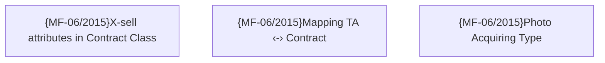

# Contract Origination

- **Diagram Type**: Custom
- **Package**: HomerSelect/BSL/Requirements Model/TODO - Suggestion to system improvement/Contract Origination
- **Diagram ID**: 84230
- **Elements**: 3
- **Connectors**: 0

