# Product Management

- **Diagram Type**: Custom
- **Package**: HomerSelect/BSL/Requirements Model/TODO - Suggestion to system improvement/Product Catalogue
- **Diagram ID**: 100716
- **Elements**: 9
- **Connectors**: 0

```mermaid
graph TD
    ES_05_2017_Service_Assignment_to_Product["{ES-05/2017}Service Assignment to Product"]
    ES_11_2016_Service_parameters_from_BSL_to_AM["{ES-11/2016}Service parameters from BSL to AM"]
    ES_11_2016_On_line_code_lists["{ES-11/2016}On-line code-lists"]
    ES_10_2016_Insurance_Service_Selection["{ES-10/2016}Insurance Service Selection"]
    ES_09_2016_Product_Profile_Flags["{ES-09/2016}Product Profile Flags"]
    ES_07_2016_Billing_day_algorithm_unification["{ES-07/2016}Billing day algorithm unification"]
    ES_07_2016_Cross_check_TIT_Usage_x_TI_Base["{ES-07/2016}Cross check TIT Usage x TI Base"]
    ES_06_2015_Tariff_Item_Type_business_code["{ES-06/2015}Tariff Item Type - business code"]
    ES_01_2015_Automatic_activation_of_versioned_entities["{ES-01/2015}Automatic activation of versioned entities"]
```

