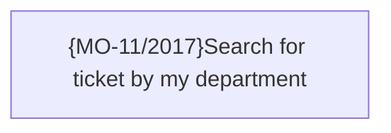

# Ticketing improvement

- **Diagram Type**: Custom
- **Package**: HomerSelect/BSL/Requirements Model/TODO - Suggestion to system improvement/Ticketing
- **Diagram ID**: 93354
- **Elements**: 1
- **Connectors**: 0

