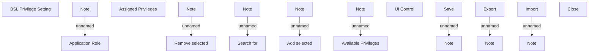

# BSL Privilege Setting

```mermaid
graph TD
    BSL_Privilege_Setting["BSL Privilege Setting"]
    Application_Role["Application Role"]
    el_1137901["Note"]
    Assigned_Privileges["Assigned Privileges"]
    Remove_selected["Remove selected"]
    el_1137904["Note"]
    Available_Privileges["Available Privileges"]
    el_1137906["Note"]
    Search_for["Search for"]
    Add_selected["Add selected"]
    el_1137910["Note"]
    el_1137911["Note"]
    UI_Control["UI Control"]
    Save["Save"]
    Export["Export"]
    Import["Import"]
    Close["Close"]
    el_1137917["Note"]
    el_1137918["Note"]
    el_1137919["Note"]
    el_1137901 -->|unnamed| Application_Role
    el_1137904 -->|unnamed| Remove_selected
    el_1137906 -->|unnamed| Search_for
    el_1137910 -->|unnamed| Add_selected
    el_1137911 -->|unnamed| Available_Privileges
    Save -->|unnamed| el_1137917
    Export -->|unnamed| el_1137918
    Import -->|unnamed| el_1137919
```
