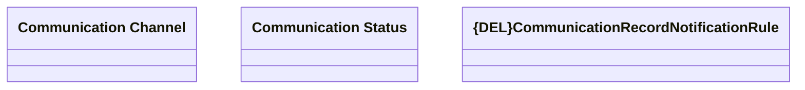

# External Reference

- **Diagram Type**: Logical
- **Package**: 
- **Diagram ID**: 156287
- **Elements**: 3
- **Connectors**: 0

```mermaid
classDiagram
    class Communication_Channel["Communication Channel"]
    class Communication_Status["Communication Status"]
    class DEL_CommunicationRecordNotificationRule["{DEL}CommunicationRecordNotificationRule"]
```
