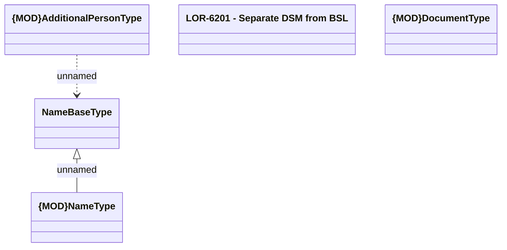

# External Reference

- **Diagram Type**: Logical
- **Package**: 
- **Diagram ID**: 149725
- **Elements**: 5
- **Connectors**: 2

```mermaid
classDiagram
    class MOD_AdditionalPersonType["{MOD}AdditionalPersonType"]
    class NameBaseType["NameBaseType"]
    class LOR_6201_Separate_DSM_from_BSL["LOR-6201 - Separate DSM from BSL"]
    class MOD_NameType["{MOD}NameType"]
    class MOD_DocumentType["{MOD}DocumentType"]
    NameBaseType <|-- MOD_NameType : unnamed
    MOD_AdditionalPersonType ..> NameBaseType : unnamed
```
