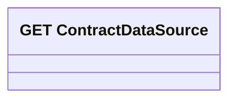

# External Reference

- **Diagram Type**: Logical
- **Package**: 
- **Diagram ID**: 149726
- **Elements**: 1
- **Connectors**: 0

```mermaid
classDiagram
    class GET_ContractDataSource["GET ContractDataSource"]
```
