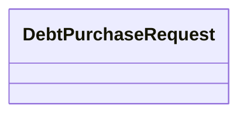

# External Reference

- **Diagram Type**: Logical
- **Package**: 
- **Diagram ID**: 164652
- **Elements**: 1
- **Connectors**: 0

```mermaid
classDiagram
    class DebtPurchaseRequest["DebtPurchaseRequest"]
```
