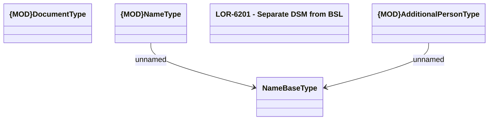

# External Reference

```mermaid
classDiagram
    class MOD_DocumentType["{MOD}DocumentType"]
    class MOD_NameType["{MOD}NameType"]
    class LOR_6201_Separate_DSM_from_BSL["LOR-6201 - Separate DSM from BSL"]
    class NameBaseType["NameBaseType"]
    class MOD_AdditionalPersonType["{MOD}AdditionalPersonType"]
    MOD_NameType --> NameBaseType : unnamed
    MOD_AdditionalPersonType --> NameBaseType : unnamed
```
