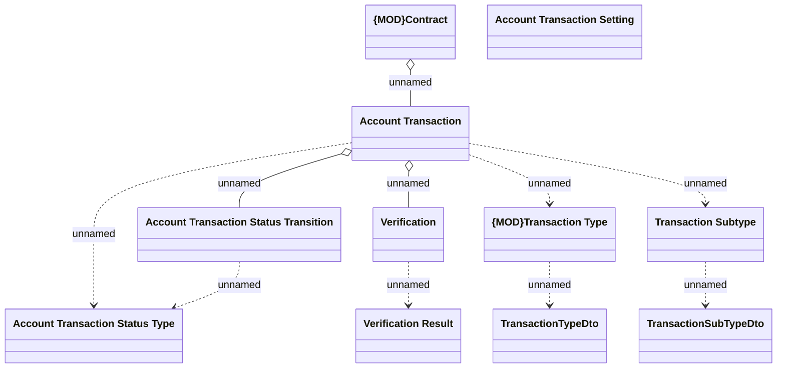

# Account transaction - Logical data model

- **Diagram Type**: Logical
- **Package**: HomerSelect/BSL/Analysis Model/Account management/Account transaction/Logical data model
- **Diagram ID**: 162541
- **Elements**: 11
- **Connectors**: 10

