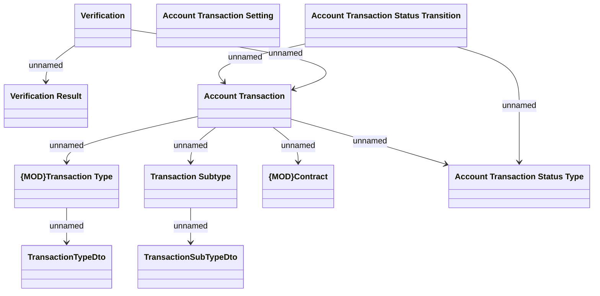

# Account transaction - Logical data model

```mermaid
classDiagram
    class Verification_Result["Verification Result"]
    class Verification["Verification"]
    class TransactionSubTypeDto["TransactionSubTypeDto"]
    class Transaction_Subtype["Transaction Subtype"]
    class TransactionTypeDto["TransactionTypeDto"]
    class MOD_Transaction_Type["{MOD}Transaction Type"]
    class MOD_Contract["{MOD}Contract"]
    class Account_Transaction_Setting["Account Transaction Setting"]
    class Account_Transaction_Status_Type["Account Transaction Status Type"]
    class Account_Transaction_Status_Transition["Account Transaction Status Transition"]
    class Account_Transaction["Account Transaction"]
    Account_Transaction_Status_Transition --> Account_Transaction : unnamed
    Verification --> Account_Transaction : unnamed
    Account_Transaction --> Account_Transaction_Status_Type : unnamed
    Account_Transaction_Status_Transition --> Account_Transaction_Status_Type : unnamed
    Account_Transaction --> MOD_Transaction_Type : unnamed
    MOD_Transaction_Type --> TransactionTypeDto : unnamed
    Account_Transaction --> Transaction_Subtype : unnamed
    Transaction_Subtype --> TransactionSubTypeDto : unnamed
    Verification --> Verification_Result : unnamed
    Account_Transaction --> MOD_Contract : unnamed
```
