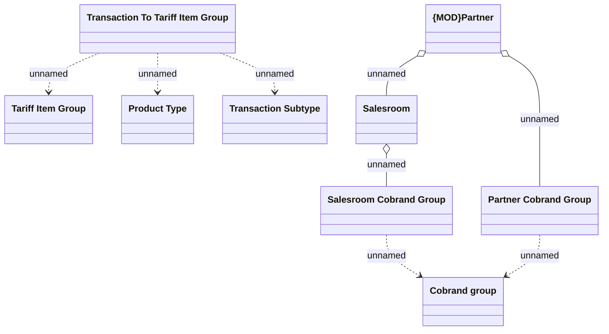

# Mapping Transaction to Tariff Item Group

- **Diagram Type**: Logical
- **Package**: HomerSelect/BSL/Analysis Model/Account management/Account transaction/Logical data model
- **Diagram ID**: 162542
- **Elements**: 9
- **Connectors**: 8

